# Discord Profile Switcher

Keep several Discord accounts signed in at once, each in its own isolated Chrome profile, and switch between them from one popup. It never asks for, reads, stores, or injects Discord tokens.


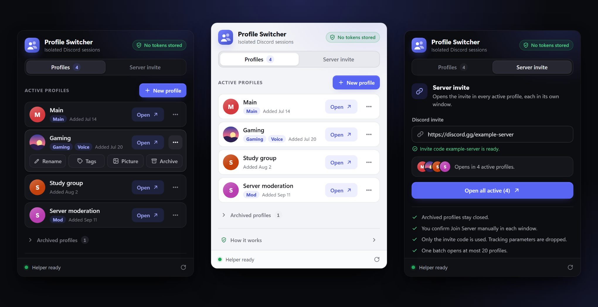

## What it does

Each saved profile is a separate Chrome user-data folder. You sign in to Discord once inside that profile's window, with your password, QR code, or MFA, and Chrome keeps the session there. Next time you click **Open** and the same signed-in window comes back.

- **One click per account.** Every profile opens in its own Chrome window at `discord.com`.
- **Nothing to paste.** Sign in on Discord's real login page. The extension never sees a token, and it rejects profile names that look like one.
- **Organize.** Give profiles names, up to two tags such as `Main` or `Backup`, and a small local picture. Search appears once you have six or more profiles.
- **Server invites.** Paste one invite link and open it in every active profile at once. You still review and click *Join Server* yourself in each window.
- **Archive, Undo, Delete.** Archiving is instant and reversible. Deleting permanently removes an archived profile and its Chrome data from your PC.
- **Dark and light themes** that follow your system setting.

## Screenshots

| Profiles | Profile actions | Server invite |
| :---: | :---: | :---: |
| 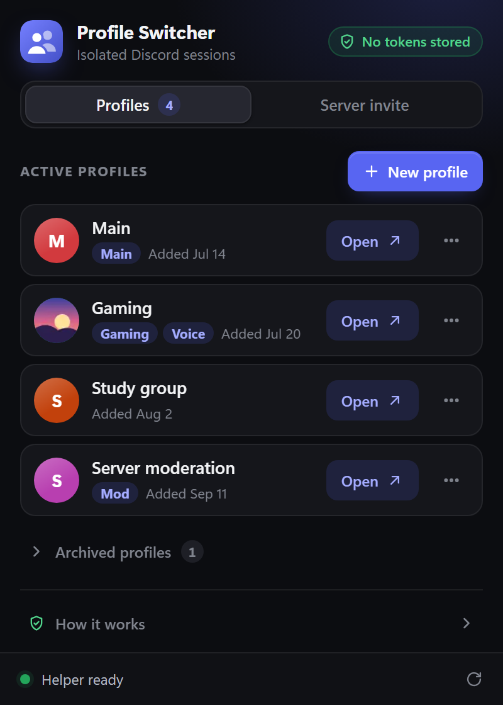 | 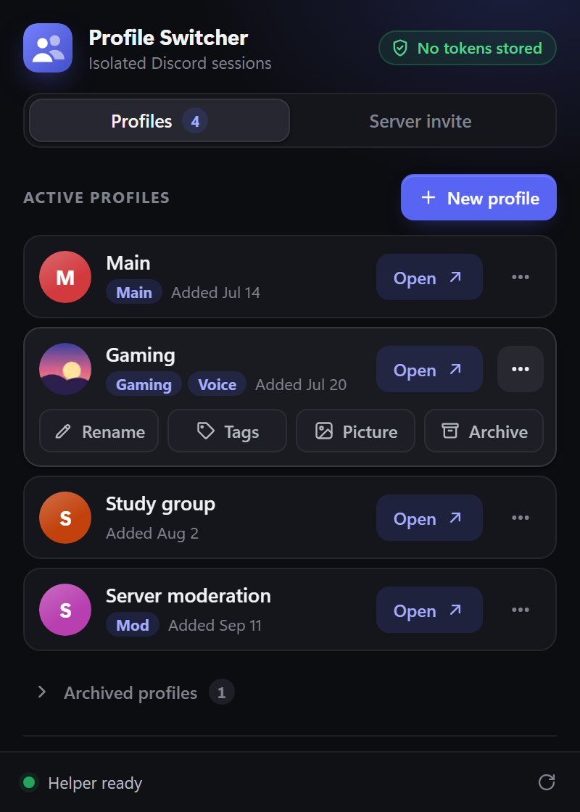 | 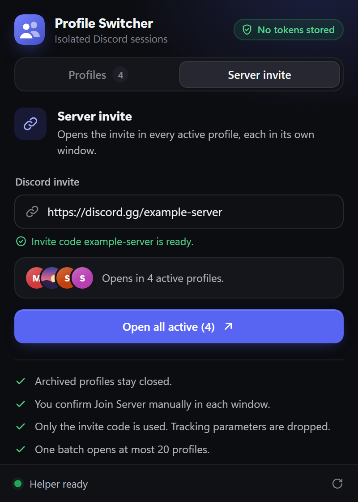 |
| **New profile** | **Archive with Undo** | **Archived profiles** |
| 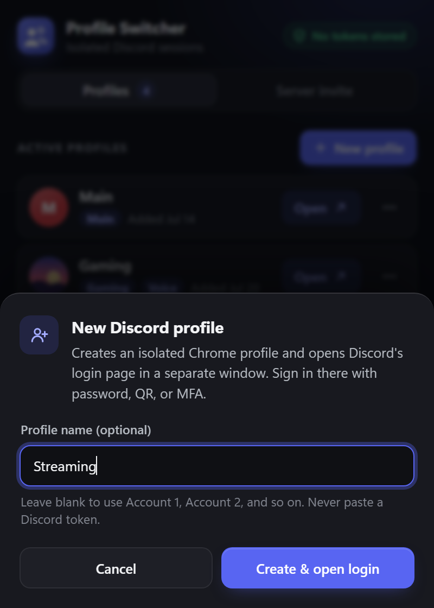 | 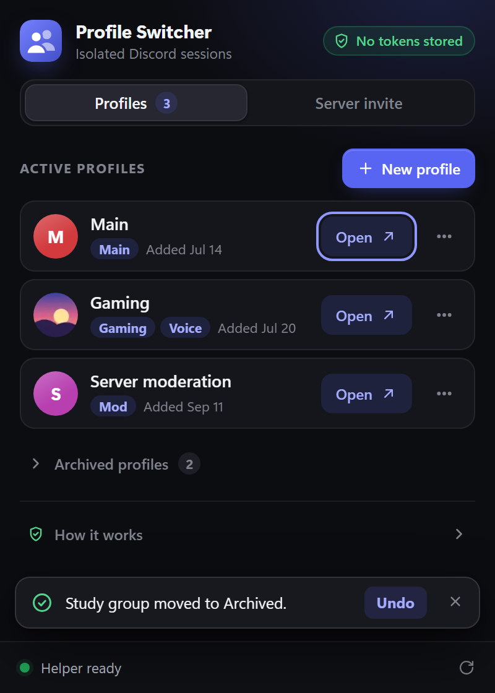 | 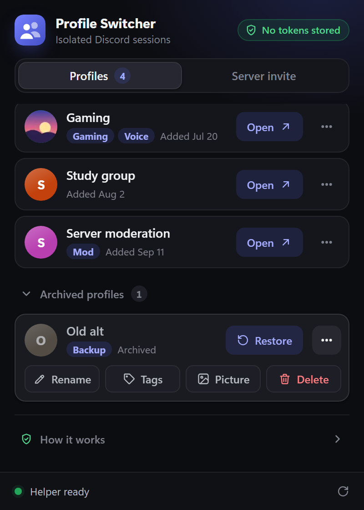 |
| **Delete confirmation** | **First run** | **Light theme** |
| 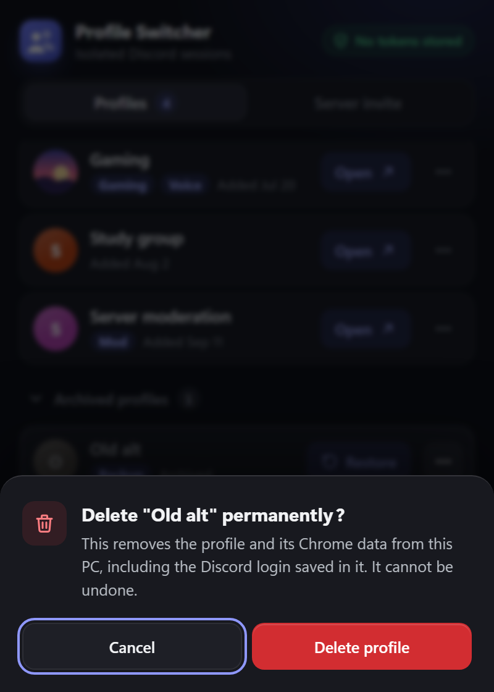 | 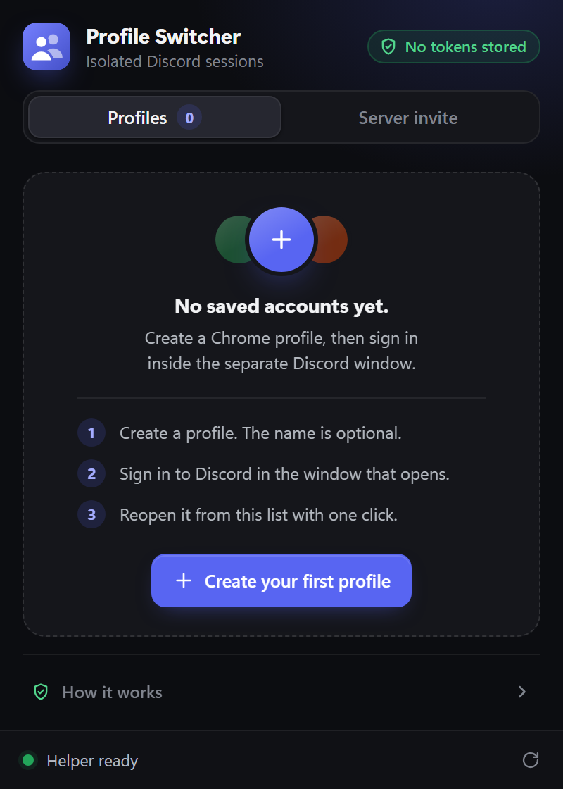 | 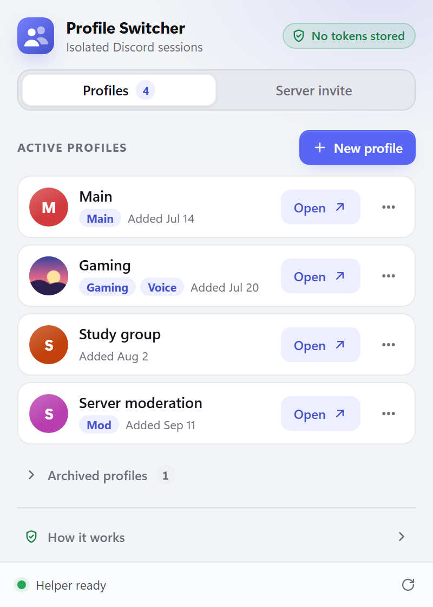 |

## How it works

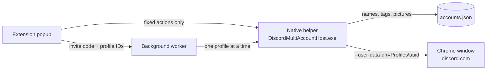

Chrome extensions cannot start Chrome with a different profile folder, so a small Windows helper does that part. The extension talks to it through Chrome's Native Messaging, which allows only this extension's ID. The helper accepts a short list of fixed actions and always opens a fixed Discord address. It never takes a URL, a file path, or command-line flags from the extension.

The helper is self-contained, so it runs without installing .NET.

## Install (Windows)

1. Download or clone this repository.
2. Open `chrome://extensions` in your main Chrome profile, turn on **Developer mode**, click **Load unpacked**, and select the `extension` folder.
3. Install the helper by double-clicking `scripts\install-native-host.cmd`.
   - If `artifacts\native-host\DiscordMultiAccountHost.exe` exists (for example, downloaded from this repository's Releases page), the installer checks its SHA-256 hash and uses it.
   - Otherwise it builds the helper from source, which needs the [.NET 8 SDK](https://dotnet.microsoft.com/download) or newer.
4. Reload Chrome, pin **Discord Profile Switcher**, open it, and check that the bottom bar says **Helper ready**.

The extension has a fixed development ID, `ofnblgcbllibhicnkjhogibgpjmnpncf`, which the helper is locked to.

> Updating from an older version? Run `scripts\install-native-host.cmd` again. The popup shows **Helper update required** until the helper matches.

## Using it

### Add an account

1. On the **Profiles** tab, click **New profile**.
2. Optionally type a short local name such as `Gaming` or `Work`. Leave it blank to get `Account 1`, `Account 2`, and so on.
3. Click **Create & open login**. The profile is saved first, then a separate Chrome window opens at Discord's login page.
4. Sign in there normally. Chrome keeps that session inside the profile.

Next time, click **Open** beside the name. If Discord asks you to sign in again, the session expired, was revoked, or the first login was not finished in that window.

This does not copy the Discord account already open in your current tab. Never paste a Discord token anywhere; token-shaped names are rejected, and suspicious names saved by older versions are hidden.

### Organize profiles

Click **⋯** on a profile to show its actions:

- **Rename** changes the local name only. The Discord account, the Chrome folder, and the saved session stay the same.
- **Tags** adds one or two short reminders, separated by a comma. Leave the field blank to remove them. Tags are plain local text, so never use passwords, tokens, recovery codes, or email addresses.
- **Picture** (or click the round avatar) picks a local PNG, JPEG, or WebP image. The popup center-crops it, re-encodes it as a tiny 64×64 WebP, drops the filename and metadata, and saves only that copy. It never fetches pictures from Discord.

### Open a server invite in every profile

Open the **Server invite** tab and paste an invite code or an exact `discord.gg/...` or `discord.com/invite/...` link. The field shows the detected code as you type. Click **Open all active**, confirm once, and the invite page opens in every active profile, one window each.

- Archived profiles stay closed.
- The extension does not join the server. Review it and click *Join Server* yourself in each window. It never clicks Discord buttons, bypasses rules or CAPTCHA, calls Discord APIs, or reads the page.
- Only the invite code is used. The rest of the link, including tracking parameters, is discarded.
- One batch opens at most 20 profiles, and it keeps running if the popup closes.

### Archive, restore, and delete

- **Archive** moves a profile out of the active list right away. Click **Undo** in the message that appears, or **Restore** later from **Archived profiles**. Archiving never touches the Chrome profile folder.
- **Delete** is available on archived profiles. After you confirm, the helper removes the profile and its Chrome folder, including the Discord login saved in it. This cannot be undone.
  - Close that profile's Chrome window first. If it is still open, deleting is refused and nothing changes.
  - Deleting removes the session from your PC but does not sign it out on Discord's servers. To do that, use **User Settings → Devices** in Discord.

## Where your data lives

| What | Where |
| --- | --- |
| Names, tags, IDs, archive state, and tiny pictures | `%LOCALAPPDATA%\DiscordMultiAccount\accounts.json` |
| One isolated Chrome profile per account | `%LOCALAPPDATA%\DiscordMultiAccount\Profiles\<uuid>` |
| Installed helper | `%LOCALAPPDATA%\DiscordMultiAccount\NativeHost` |

Everything stays on your PC. Nothing is sent anywhere by this project.

## Security

The short version:

- The extension's only permission is `nativeMessaging`. It has no content scripts, no access to Discord pages, no cookie or tab access, and no remote code.
- The helper validates every request strictly: exact fields, canonical profile IDs, fixed destinations, and no paths or URLs from the extension.
- Tokens are never accepted, stored, logged, or injected.

See [SECURITY.md](SECURITY.md) for the full model, including how deletion refuses in-use profiles and linked folders.

If a Discord token was ever pasted into an unknown website, script, or extension, change your Discord password and log out of unknown devices before using this project.

## Uninstall

Double-click `scripts\uninstall-native-host.cmd`, then remove the extension from `chrome://extensions`. The uninstaller keeps `accounts.json` and your profiles, so reinstalling brings the list back. To remove a profile's data, delete it from the popup first.

## Development

```text
extension/         Chrome extension (Manifest V3): popup UI and background worker
native-host/       Windows helper (.NET 8) that stores metadata and launches Chrome
scripts/           Install and uninstall the helper, generate icons
tests/             Node test suites for the extension, worker, and helper
docs/screenshots/  Images used in this README
```

Build the helper and run the tests from the repository root:

```powershell
dotnet publish .\native-host\DiscordMultiAccountHost.csproj -c Release -f net8.0-windows -r win-x64 --self-contained true -o .\artifacts\native-host
node --check .\extension\popup.js
node --check .\extension\background.js
node .\tests\test-extension.mjs
node .\tests\test-background.mjs
node .\tests\test-popup-security.mjs
node .\tests\test-host.mjs
```

`test-host.mjs` sends only requests that must be refused to your real helper data. To also run the create, rename, archive, and delete tests in an isolated temporary folder, set `RUN_METADATA_TESTS=1`:

```powershell
$env:RUN_METADATA_TESTS = "1"; node .\tests\test-host.mjs
```

After rebuilding the helper, update `$ExpectedHostHash` in `scripts\install-native-host.ps1` to the new file's SHA-256, or the installer will refuse the prebuilt file.

---

This project is not affiliated with or endorsed by Discord Inc.
